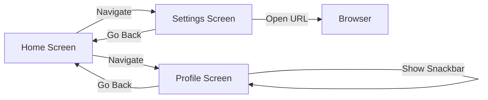

# 🎯 Server-Driven UI (SDUI) Implementation Guide

This document breaks down the SDUI assignment into **5 implementation chunks**. Each chunk includes clear explanations of **what**, **why**, **where**, and **how** to implement each feature.

---

## 📁 Project Structure Overview

```
sdui_sample_app/
├── sdui_models/     # Shared data models (used by both server & client)
│   └── lib/
│       ├── models/
│       │   ├── screens/       # Screen model definitions
│       │   ├── components/    # UI component models
│       │   └── actions/       # Action type models
│       └── sdui_models.dart   # Barrel export file
│
├── sdui_server/     # Dart HTTP server (emits UI JSON)
│   └── bin/
│       └── server.dart        # Main server entry point
│
└── sdui_client/     # Flutter app (renders UI dynamically)
    └── lib/
        ├── core/              # API service, mappers, handlers
        ├── screens/           # SDUIScreen widget
        └── main.dart
```

---

# 🧩 CHUNK 1: Project Setup

## ✅ Objectives
- [ ] Create folder structure
- [ ] Initialize three Dart/Flutter packages
- [ ] Set up inter-package dependencies

## 📍 Where
```
q:\flutter\server-driven-UI\
├── sdui_models/
├── sdui_server/
└── sdui_client/
```

## 🤔 Why This Structure?
| Package | Purpose |
|---------|---------|
| `sdui_models` | **Single source of truth** for data contracts. Both server and client import this to ensure type-safe serialization/deserialization. |
| `sdui_server` | Dart backend that builds screen definitions and returns JSON. Decoupled from Flutter. |
| `sdui_client` | Flutter app that fetches JSON and renders UI dynamically. No hardcoded screens. |

## 🔧 How to Implement

### 1.1 Create sdui_models package
```bash
cd q:\flutter\server-driven-UI
mkdir sdui_models && cd sdui_models
dart create -t package .
```

### 1.2 Create sdui_server package
```bash
cd q:\flutter\server-driven-UI
mkdir sdui_server && cd sdui_server
dart create -t server-shelf .
```

### 1.3 Create sdui_client Flutter app
```bash
cd q:\flutter\server-driven-UI
flutter create sdui_client
```

### 1.4 Link packages via path dependencies
In `sdui_server/pubspec.yaml`:
```yaml
dependencies:
  sdui_models:
    path: ../sdui_models
```

In `sdui_client/pubspec.yaml`:
```yaml
dependencies:
  sdui_models:
    path: ../sdui_models
```

---

# 🧩 CHUNK 2: Shared Models Layer

## ✅ Objectives
- [ ] Define base screen models
- [ ] Define component models (8 types)
- [ ] Define action models (5 types)
- [ ] Add JSON serialization with `freezed` + `json_serializable`

## 📍 Where
```
sdui_models/lib/
├── models/
│   ├── screens/
│   │   ├── screen_model.dart       # Base sealed class
│   │   ├── vertical_screen.dart
│   │   └── error_screen.dart
│   ├── components/
│   │   ├── component_model.dart    # Base sealed class
│   │   ├── title_component.dart
│   │   ├── spacer_component.dart
│   │   ├── image_banner.dart
│   │   ├── button_component.dart
│   │   ├── card_component.dart
│   │   ├── horizontal_list.dart
│   │   ├── info_tile.dart
│   │   └── divider_component.dart
│   └── actions/
│       ├── action_model.dart       # Base sealed class
│       ├── navigate_action.dart
│       ├── go_back_action.dart
│       ├── snackbar_action.dart
│       ├── open_url_action.dart
│       └── log_event_action.dart
└── sdui_models.dart                # Barrel exports
```

## 🤔 Why This Design?

### Sealed Classes for Type Safety
```dart
sealed class ComponentModel {
  const ComponentModel();
  
  factory ComponentModel.fromJson(Map<String, dynamic> json) {
    return switch (json['runtimeType']) {
      'title' => TitleComponent.fromJson(json),
      'button' => ButtonComponent.fromJson(json),
      // ... other types
      _ => throw UnimplementedError(),
    };
  }
}
```

**Benefits:**
- Exhaustive pattern matching in client mappers
- Type-safe JSON deserialization
- Compile-time checking for missing component handlers

### Why freezed + json_serializable?
- **Immutability**: Models can't be accidentally mutated
- **copyWith**: Easy to create modified copies
- **toJson/fromJson**: Auto-generated serialization
- **Discriminator field**: `runtimeType` identifies the polymorphic type

## 🔧 How to Implement

### 2.1 Add dependencies to sdui_models/pubspec.yaml
```yaml
dependencies:
  freezed_annotation: ^2.4.1
  json_annotation: ^4.8.1

dev_dependencies:
  build_runner: ^2.4.8
  freezed: ^2.4.7
  json_serializable: ^6.7.1
```

### 2.2 Example: Screen Model
```dart
// lib/models/screens/screen_model.dart
import 'package:freezed_annotation/freezed_annotation.dart';
import '../components/component_model.dart';

part 'screen_model.freezed.dart';
part 'screen_model.g.dart';

@Freezed(unionKey: 'runtimeType')
sealed class ScreenModel with _$ScreenModel {
  const factory ScreenModel.vertical({
    required String screenTitle,
    required List<ComponentModel> components,
  }) = VerticalScreenModel;

  const factory ScreenModel.error({
    required String errorMessage,
    String? retryActionLabel,
  }) = ErrorScreenModel;

  factory ScreenModel.fromJson(Map<String, dynamic> json) =>
      _$ScreenModelFromJson(json);
}
```

### 2.3 Example: Component Model
```dart
// lib/models/components/component_model.dart
@Freezed(unionKey: 'runtimeType')
sealed class ComponentModel with _$ComponentModel {
  const factory ComponentModel.title({
    required String title,
  }) = TitleComponent;

  const factory ComponentModel.button({
    required String label,
    required ActionModel action,
  }) = ButtonComponent;
  
  // ... other components

  factory ComponentModel.fromJson(Map<String, dynamic> json) =>
      _$ComponentModelFromJson(json);
}
```

### 2.4 Generate code
```bash
cd sdui_models
dart run build_runner build --delete-conflicting-outputs
```

---

# 🧩 CHUNK 3: Server Implementation

## ✅ Objectives
- [ ] Set up shelf HTTP server
- [ ] Create screen builder functions
- [ ] Implement `/screens/{screen_name}` endpoint
- [ ] Return proper JSON responses

## 📍 Where
```
sdui_server/bin/
├── server.dart          # Entry point, routes
└── screens/
    ├── home_screen.dart
    ├── profile_screen.dart
    └── settings_screen.dart
```

## 🤔 Why This Architecture?

### Screen Builder Pattern
Each screen has its own builder function that returns a `ScreenModel`:

```dart
ScreenModel buildHomeScreen() {
  return ScreenModel.vertical(
    screenTitle: 'Home',
    components: [
      ComponentModel.title(title: 'Welcome to SDUI App'),
      ComponentModel.imageBanner(imageUrl: 'https://...'),
      // ...
    ],
  );
}
```

**Benefits:**
- Easy to maintain and extend
- Type-safe: compiler catches invalid component configurations
- Testable: each builder can be unit tested

### Endpoint Design
```
POST /screens/{screen_name}
```

**Why POST?**  
While GET could work, POST allows sending client context (user ID, preferences) in the request body for personalized UIs.

## 🔧 How to Implement

### 3.1 Set up shelf server
```dart
// bin/server.dart
import 'package:shelf/shelf.dart';
import 'package:shelf/shelf_io.dart' as io;
import 'package:shelf_router/shelf_router.dart';
import 'package:sdui_models/sdui_models.dart';

void main() async {
  final router = Router();

  router.post('/screens/<screenName>', (Request request, String screenName) {
    final screen = switch (screenName) {
      'home' => buildHomeScreen(),
      'profile' => buildProfileScreen(),
      'settings' => buildSettingsScreen(),
      _ => ScreenModel.error(errorMessage: 'Screen not found'),
    };
    
    return Response.ok(
      jsonEncode(screen.toJson()),
      headers: {'Content-Type': 'application/json'},
    );
  });

  final handler = Pipeline()
      .addMiddleware(logRequests())
      .addHandler(router);

  await io.serve(handler, 'localhost', 8080);
  print('Server running on http://localhost:8080');
}
```

### 3.2 Screen Definitions

#### Home Screen
```dart
ScreenModel buildHomeScreen() => ScreenModel.vertical(
  screenTitle: 'Home',
  components: [
    ComponentModel.title(title: 'Welcome to SDUI App'),
    ComponentModel.imageBanner(imageUrl: 'https://picsum.photos/400/200'),
    ComponentModel.horizontalList(
      items: List.generate(4, (i) => 
        ComponentModel.card(title: 'Card ${i+1}', subtitle: 'Description')
      ),
    ),
    ComponentModel.button(
      label: 'Go to Profile',
      action: ActionModel.navigate(destination: 'profile'),
    ),
    ComponentModel.button(
      label: 'Go to Settings',
      action: ActionModel.navigate(destination: 'settings'),
    ),
  ],
);
```

#### Profile Screen
```dart
ScreenModel buildProfileScreen() => ScreenModel.vertical(
  screenTitle: 'Profile',
  components: [
    ComponentModel.title(title: 'Your Profile'),
    ComponentModel.infoTile(
      avatarUrl: 'https://i.pravatar.cc/150',
      title: 'John Doe',
      subtitle: 'john.doe@email.com',
    ),
    ComponentModel.card(title: 'Stats', subtitle: '150 posts • 2.5k followers'),
    ComponentModel.button(
      label: 'Show Message',
      action: ActionModel.showSnackbar(message: 'Hello from SDUI!'),
    ),
    ComponentModel.button(
      label: 'Go Back',
      action: ActionModel.goBack(),
    ),
  ],
);
```

#### Settings Screen
```dart
ScreenModel buildSettingsScreen() => ScreenModel.vertical(
  screenTitle: 'Settings',
  components: [
    ComponentModel.title(title: 'Settings'),
    ComponentModel.infoTile(title: 'Notifications', subtitle: 'Manage alerts'),
    ComponentModel.divider(),
    ComponentModel.infoTile(title: 'Privacy', subtitle: 'Control your data'),
    ComponentModel.divider(),
    ComponentModel.infoTile(title: 'About', subtitle: 'App version 1.0.0'),
    ComponentModel.button(
      label: 'Visit Website',
      action: ActionModel.openUrl(url: 'https://flutter.dev'),
    ),
    ComponentModel.button(
      label: 'Go Back',
      action: ActionModel.goBack(),
    ),
  ],
);
```

---

# 🧩 CHUNK 4: Client Implementation

## ✅ Objectives
- [ ] Create API service to fetch screens
- [ ] Build screen mapper (ScreenModel → Widget)
- [ ] Build component mapper (ComponentModel → Widget)
- [ ] Build action handler
- [ ] Create SDUIScreen widget with loading/error states

## 📍 Where
```
sdui_client/lib/
├── core/
│   ├── api/
│   │   └── sdui_api_service.dart
│   ├── mappers/
│   │   ├── screen_mapper.dart
│   │   └── component_mapper.dart
│   └── handlers/
│       └── action_handler.dart
├── screens/
│   └── sdui_screen.dart
└── main.dart
```

## 🤔 Why This Architecture?

### Separation of Concerns
```
┌──────────────┐    ┌──────────────┐    ┌──────────────┐
│  API Service │ →  │    Mappers   │ →  │   Widgets    │
│  (fetch JSON)│    │ (model→widget)│   │  (render UI) │
└──────────────┘    └──────────────┘    └──────────────┘
```

### Component Mapper Pattern
Uses exhaustive pattern matching to ensure all component types are handled:

```dart
Widget mapComponent(ComponentModel component, ActionHandler handler) {
  return switch (component) {
    TitleComponent(:final title) => Text(title, style: ...),
    ButtonComponent(:final label, :final action) => 
      ElevatedButton(onPressed: () => handler.execute(action), child: Text(label)),
    // Compiler error if any type is missing!
  };
}
```

### Action Handler Pattern
Centralizes all side effects:

```dart
class ActionHandler {
  final BuildContext context;
  
  void execute(ActionModel action) {
    switch (action) {
      case NavigateAction(:final destination):
        Navigator.pushNamed(context, '/$destination');
      case GoBackAction():
        Navigator.pop(context);
      case ShowSnackbarAction(:final message):
        ScaffoldMessenger.of(context).showSnackBar(SnackBar(content: Text(message)));
      case OpenUrlAction(:final url):
        launchUrl(Uri.parse(url));
      case LogEventAction(:final eventName):
        debugPrint('Event: $eventName');
    }
  }
}
```

## 🔧 How to Implement

### 4.1 API Service
```dart
// lib/core/api/sdui_api_service.dart
class SduiApiService {
  final String baseUrl;
  final http.Client _client;

  SduiApiService({required this.baseUrl}) : _client = http.Client();

  Future<ScreenModel> fetchScreen(String screenName) async {
    final response = await _client.post(
      Uri.parse('$baseUrl/screens/$screenName'),
    );
    
    if (response.statusCode == 200) {
      return ScreenModel.fromJson(jsonDecode(response.body));
    }
    throw Exception('Failed to load screen');
  }
}
```

### 4.2 SDUIScreen Widget
```dart
// lib/screens/sdui_screen.dart
class SDUIScreen extends StatefulWidget {
  final String screenName;
  
  @override
  State<SDUIScreen> createState() => _SDUIScreenState();
}

class _SDUIScreenState extends State<SDUIScreen> {
  late Future<ScreenModel> _screenFuture;

  @override
  void initState() {
    super.initState();
    _screenFuture = context.read<SduiApiService>().fetchScreen(widget.screenName);
  }

  @override
  Widget build(BuildContext context) {
    return FutureBuilder<ScreenModel>(
      future: _screenFuture,
      builder: (context, snapshot) {
        if (snapshot.connectionState == ConnectionState.waiting) {
          return const Center(child: CircularProgressIndicator());
        }
        if (snapshot.hasError) {
          return ErrorScreen(message: snapshot.error.toString());
        }
        return ScreenMapper.map(snapshot.data!, context);
      },
    );
  }
}
```

### 4.3 Component Mapper
```dart
// lib/core/mappers/component_mapper.dart
class ComponentMapper {
  static Widget map(ComponentModel component, ActionHandler handler) {
    return switch (component) {
      TitleComponent(:final title) => Padding(
        padding: EdgeInsets.all(16),
        child: Text(title, style: TextStyle(fontSize: 24, fontWeight: FontWeight.bold)),
      ),
      SpacerComponent(:final height) => SizedBox(height: height),
      ImageBannerComponent(:final imageUrl) => Image.network(imageUrl, fit: BoxFit.cover),
      ButtonComponent(:final label, :final action) => Padding(
        padding: EdgeInsets.symmetric(horizontal: 16, vertical: 8),
        child: ElevatedButton(
          onPressed: () => handler.execute(action),
          child: Text(label),
        ),
      ),
      CardComponent(:final title, :final subtitle) => Card(
        margin: EdgeInsets.all(8),
        child: ListTile(title: Text(title), subtitle: Text(subtitle ?? '')),
      ),
      HorizontalListComponent(:final items) => SizedBox(
        height: 120,
        child: ListView.builder(
          scrollDirection: Axis.horizontal,
          itemCount: items.length,
          itemBuilder: (_, i) => map(items[i], handler),
        ),
      ),
      InfoTileComponent(:final title, :final subtitle, :final avatarUrl) => ListTile(
        leading: avatarUrl != null ? CircleAvatar(backgroundImage: NetworkImage(avatarUrl)) : null,
        title: Text(title),
        subtitle: subtitle != null ? Text(subtitle) : null,
      ),
      DividerComponent() => Divider(),
    };
  }
}
```

---

# 🧩 CHUNK 5: Integration & Testing

## ✅ Objectives
- [ ] Configure client to connect to server
- [ ] Set up navigation routes
- [ ] Test complete flow: Home → Profile → Back
- [ ] Test complete flow: Home → Settings → Back
- [ ] Test all action types

## 📍 Where
- `sdui_client/lib/main.dart` - App configuration
- Manual testing via running app

## 🔧 How to Implement

### 5.1 Configure Main App
```dart
// lib/main.dart
void main() {
  runApp(
    Provider(
      create: (_) => SduiApiService(baseUrl: 'http://localhost:8080'),
      child: MaterialApp(
        initialRoute: '/home',
        onGenerateRoute: (settings) {
          final screenName = settings.name?.replaceFirst('/', '') ?? 'home';
          return MaterialPageRoute(
            builder: (_) => SDUIScreen(screenName: screenName),
          );
        },
      ),
    ),
  );
}
```

### 5.2 Run the System

**Terminal 1 - Start Server:**
```bash
cd sdui_server
dart run bin/server.dart
```

**Terminal 2 - Run Flutter App:**
```bash
cd sdui_client
flutter run
```

### 5.3 Test Checklist
| Test | Expected Result |
|------|-----------------|
| App launches | Shows Home screen with title, banner, cards, buttons |
| Tap "Go to Profile" | Navigates to Profile screen |
| Tap "Show Message" on Profile | Shows snackbar |
| Tap "Go Back" on Profile | Returns to Home |
| Tap "Go to Settings" | Navigates to Settings screen |
| Tap "Visit Website" | Opens browser |
| Tap "Go Back" on Settings | Returns to Home |

---

# 📊 Navigation Flow Diagram



---

# 🚀 Quick Start Commands

```bash
# 1. Clone and setup
cd q:\flutter\server-driven-UI

# 2. Install dependencies
cd sdui_models && dart pub get && dart run build_runner build
cd ../sdui_server && dart pub get
cd ../sdui_client && flutter pub get

# 3. Run server (Terminal 1)
cd sdui_server && dart run bin/server.dart

# 4. Run client (Terminal 2)
cd sdui_client && flutter run
```

---

# ✅ Progress Tracker

Mark each chunk as you complete it:

- [ ] **CHUNK 1**: Project Setup
- [ ] **CHUNK 2**: Shared Models Layer  
- [ ] **CHUNK 3**: Server Implementation
- [ ] **CHUNK 4**: Client Implementation
- [ ] **CHUNK 5**: Integration & Testing

---

*Last Updated: 2026-02-07*
